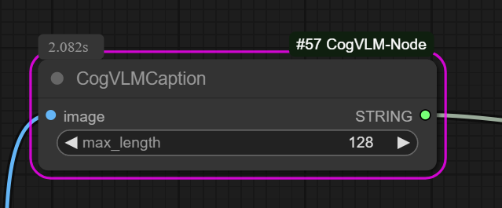

# ComfyUI_CogVLM

CogVLM captioning

Note: this code only supports CUDA (NVIDIA) and needs xformers support/enabled with bf16. You can edit the code if you need other settings.

The model will be immediately unloaded after usage.

# Installation

#### Use the custom node manager

1. Search ComfyUI_CogVLM in nodes manager
2. Install

### Manual installation

1. Enter your virtual environment (venv/Scripts/activate OR venv/bin/activate)
2. Enter you ComfyUI/custom_nodes folder
3. `git clone https://github.com/SPOOKEXE/ComfyUI_CogVLM`
4. cd ComfyUI_CogVLM
5. pip install -r requirements.txt
5.1. You may need to reinstall torch as xformers tries to use 2.0.1 and I have had success even with 2.5.1
6. Run ComfyUI

# Usage

1. Insert a CogVLM node and link as needed

# Links

https://huggingface.co/THUDM/cogvlm-chat-hf
